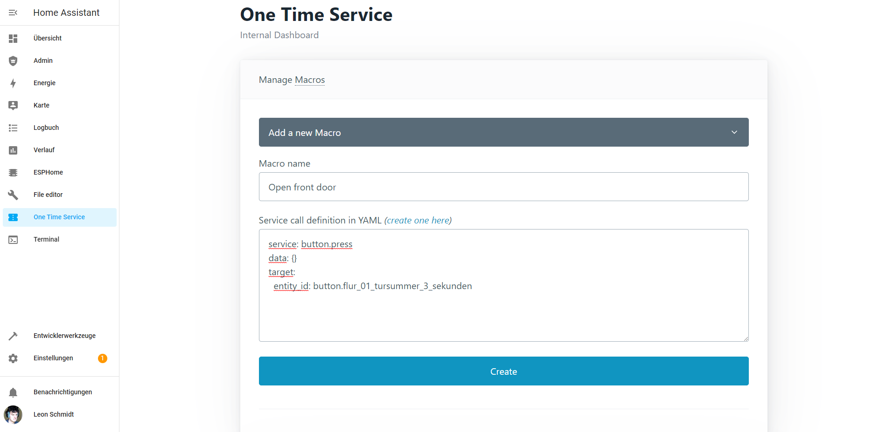
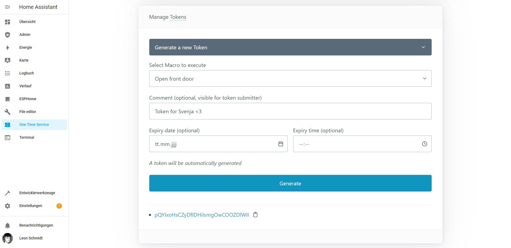
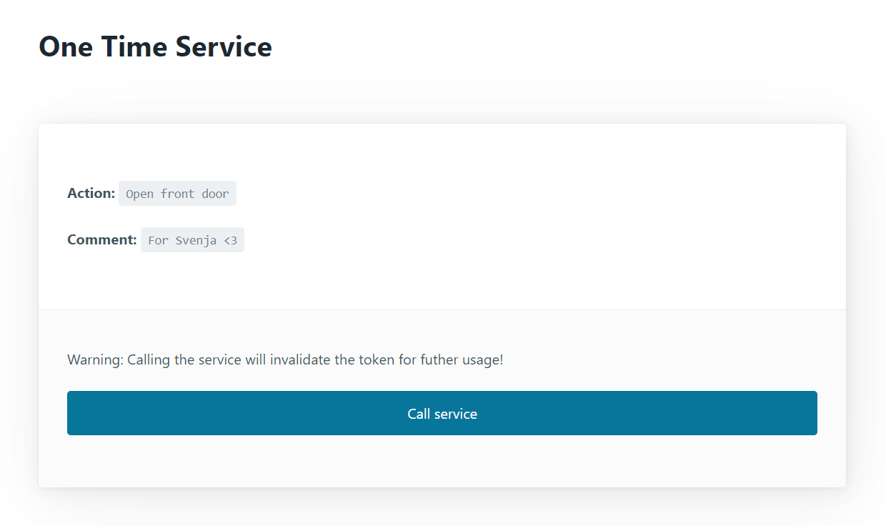

# One Time Service - Home Assistant Add-on

_Call a service with a one time token from outside Home Assistant!_

"One Time Service" lets you create publically exposed tokens for one time usage, that will execute a Home Assistant service without any authentication. This is great, e.g. for visitors who don't have an account on your Home Assistant instance.

Possible use cases:
- Allow a visitor to unlock the door themselves if no one else is at home
- Allow neighbors to notifiy you of emergencies by turning a smart RGB light red
- Let your neighbors activate your vacuum cleaner when you are on vacation

## How does it work?

The Add-on exposes a separate port (on port 1337 by default) which can be used by a reverse proxy exposed to the internet. This service is used to submit the tokens from the "outside world". The add-ons admin dashboard can be used to create the so-called Macros and Tokens.

A **Macro** is just a way to name a possibly complex Home Assistant service call for better reusability inside the add-on, e.g. if used in multiple tokens at once or if a token must be recreated on a regular basis.

A **Token** is configured to call a previously created Macro and can optionally have a comment visible on the submission page and/or an expiry time.

The differences to just using vanilla webhook automations are:
- A webhook URL can neither expire nor be invalidated once used
- The exidential use of a webhook URL can occur. E.g. when you call the webhook URL from a mobile browser, leave the page open, and reopen the browser later, the webhook is called again.

Tokens an Macro definitions are stored in a JSON file in `/share/one-time-service/db.json`.

#### Create a new Macro

#### Create a token from a Macro

#### Public Token submission page

## Tech stack

The backend is written in Go 1.18 using the [Gin Web Framework](https://github.com/gin-gonic).

The public frontend for token submission is written in plain HTML and JavaScript.

The internal ingress frontend for macro and token management is written in React (via CRA).

Both frontends use [Pico CSS](https://picocss.com/) as their CSS framework.
